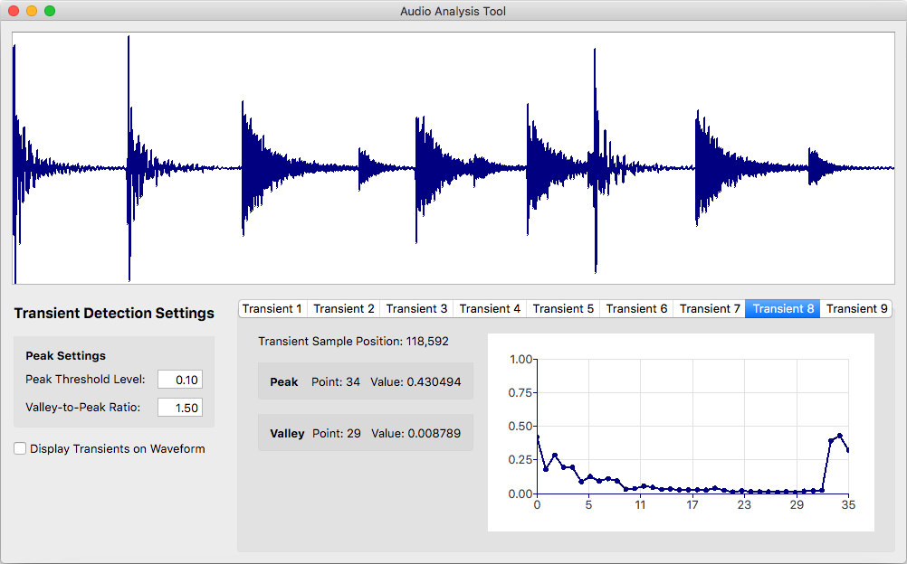

AudioAnalysisTool
=================

One of my pursuits in life involves creating software algorithms that manipulate audio in various ways.  This frequently entails analyzing various numerical data.

Tired with writing specialized scripts corralling specific data and/or wrestling with Excel, and not being crazy abouting learning yet another language ([R](https://www.r-project.org/about.html)), I set out to make my own tool to aid in analysis of my various audio processing algorithms.

I've used [Qt](https://www1.qt.io/product/) to help with this and, so far, I'm fairly happy with the results.  I've built and used this software on Windows, Ubuntu and MacOS.  Here's a current screenshot:

Currently the Audio Analysis Tool's only feature is analyzing [audio transients](https://github.com/tmdarwen/AudioLib/blob/master/Documentation/TransientDetection.md).  It allows key settings to be tweaked in attempt to improve the algorithm in certain situations.  I have a number of other additional analysis features I plan on adding though.

 

**Build Dependencies**

-   Building this project requires [CMake](https://cmake.org) version 3.0 or later.

-   Building this project requires a C++14 compliant compiler.  This project is routinely built in my continous integration system which uses MS Visual Studio 2017, GCC 5.3.1 and Apple LLVM version 7.3.0 (clang 703.0.31).

-   [Qt](https://www1.qt.io/product/) binaries, including [QtCharts](https://doc.qt.io/qt-5/qtcharts-index.html), must be installed.  I've been using Qt v5.9.2 but I imagine this project *should* build with earlier versions of Qt (possibly even back to Qt 4) and I would be surprised if it didn't build with later versions of Qt.

-   External dependencies are my [AudioLib](https://github.com/tmdarwen/AudioLib) and [GoogleTest](https://github.com/google/googletest).  You do *not* need to clone or install these dependencies manually. The GitHub repos will be cloned automatically when CMake runs.

 

**Steps for Building**

1.   Clone this repo.

1.   Create a new directory at the parallel level as the cloned repo.  This directory will hold the project files CMake creates.

1.   cd into this new directory.

1.   From the command line, run *cmake -G YourDesiredGeneratorType  -D CMAKE_PREFIX_PATH=QtPath ../AudioAnalysisTool/Source*

1.   Run make or open the project file in an IDE and build.

 

**Continuous Integration and Automated Release**

The [Automation directory](/Automation) contains scripts that can be used with [Jenkins](https://jenkins.io/) to setup continuous integration and automated release building of the AudioAnalysisTool project.  These scripts work on Windows, OS X and Linux.  For more information on how to setup Jenkins to use these scripts please see [this document](https://github.com/tmdarwen/PhaseVocoder/blob/master/Documentation/JenkinsSetup.md).

 

**Licensing**

The MIT License applies to this software and its supporting documentation:

*Copyright (c) 2017 - Terence M. Darwen - tmdarwen.com*

*Permission is hereby granted, free of charge, to any person obtaining a copy of
this software and associated documentation files (the "Software"), to deal in
the Software without restriction, including without limitation the rights to
use, copy, modify, merge, publish, distribute, sublicense, and/or sell copies of
the Software, and to permit persons to whom the Software is furnished to do so,
subject to the following conditions:*

*The above copyright notice and this permission notice shall be included in all
copies or substantial portions of the Software.*

*THE SOFTWARE IS PROVIDED "AS IS", WITHOUT WARRANTY OF ANY KIND, EXPRESS OR
IMPLIED, INCLUDING BUT NOT LIMITED TO THE WARRANTIES OF MERCHANTABILITY, FITNESS
FOR A PARTICULAR PURPOSE AND NONINFRINGEMENT. IN NO EVENT SHALL THE AUTHORS OR
COPYRIGHT HOLDERS BE LIABLE FOR ANY CLAIM, DAMAGES OR OTHER LIABILITY, WHETHER
IN AN ACTION OF CONTRACT, TORT OR OTHERWISE, ARISING FROM, OUT OF OR IN
CONNECTION WITH THE SOFTWARE OR THE USE OR OTHER DEALINGS IN THE SOFTWARE.*
